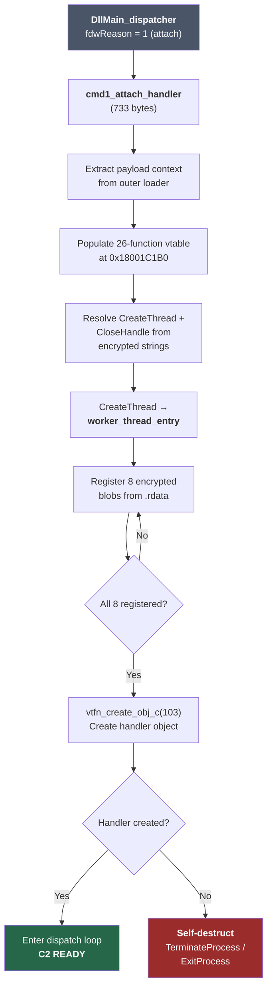
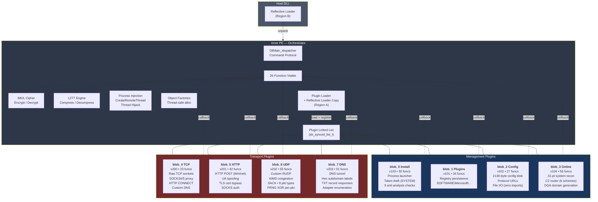
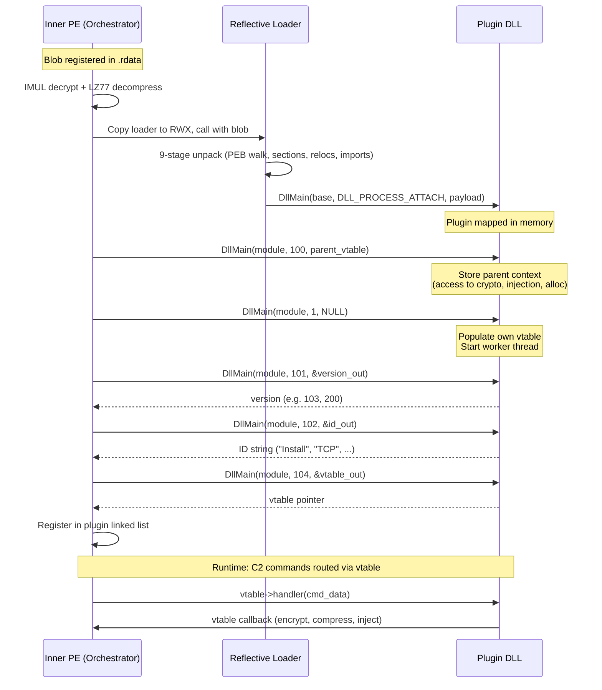

# ScatterBrain Architecture Diagrams

## 1. Boot Chain — Host DLL to C2 Ready

```mermaid
flowchart TD
    A["<b>Host DLL</b><br/>DllMain (DLL_PROCESS_ATTACH)"] --> B["CreateThread"]
    B --> C["<b>spawn_reflective_loader</b><br/>VirtualAlloc(RWX, 1MB)<br/>memmove 106KB block"]
    C --> D["Call into RWX copy"]

    D --> E["<b>Bootstrap</b> (15 bytes)<br/>call-pop trick: pushes<br/>blob address onto stack"]
    E --> F["<b>Shim</b> (18 bytes)<br/>mov rcx, rsp"]
    F --> G["<b>Reflective Loader</b><br/>(2025 bytes, Region B)"]

    G --> G1["1. PEB walk → find kernel32.dll"]
    G1 --> G2["2. Export hash resolve<br/>LoadLibraryA, GetProcAddress,<br/>VirtualAlloc, Sleep"]
    G2 --> G3["3. Validate blob magic<br/>magic0 ^ magic1 == 0x7C35D9A3"]
    G3 --> G4["4. VirtualAlloc + PRNG fill<br/>(anti-forensics)"]
    G4 --> G5["5. Copy 4 sections to mapped image"]
    G5 --> G6["6. Apply base relocations<br/>(rolling XOR decrypt)"]
    G6 --> G7["7. Zero import directory<br/>(anti-analysis)"]
    G7 --> G8["8. Decrypt imports + build<br/>obfuscated call thunks<br/>(mov rax,~addr; not rax; jmp rax)"]
    G8 --> G9["9. Call inner PE DllMain"]

    G9 --> H["<b>Inner PE Running</b>"]

    style A fill:#4a5568,color:#fff
    style G fill:#742a2a,color:#fff
    style H fill:#276749,color:#fff
```

## 2. Inner PE Initialization

## 3. Plugin Load Pipeline — Per Blob

```mermaid
flowchart LR
    A["Encrypted blob<br/>in .rdata"] --> B["<b>IMUL Stream Cipher</b><br/>4-round decrypt<br/>(index % 4)"]
    B --> C{"magic ==<br/>0x650001?"}
    C -->|No| X["<b>FAIL</b>"]
    C -->|Yes| D["Read sizes from<br/>LZ77 header"]
    D --> E["<b>LZ77 Decompress</b><br/>hash-table<br/>back-references"]
    E --> F["Packed PE blob"]

    F --> G["Copy reflective loader<br/>(2014 bytes from<br/>RVA 0x6100) to RWX"]
    G --> H["<b>Reflective Loader</b><br/>9-stage unpack"]
    H --> I["Mapped plugin DLL"]

    I --> J["CMD 100:<br/>pass parent vtable"]
    J --> K["CMD 1:<br/>attach (init vtable)"]
    K --> L["CMD 104:<br/>get vtable ptr"]
    L --> M["Insert into<br/><b>plugin linked list</b>"]

    style A fill:#4a5568,color:#fff
    style B fill:#744210,color:#fff
    style E fill:#744210,color:#fff
    style H fill:#742a2a,color:#fff
    style M fill:#276749,color:#fff
    style X fill:#9b2c2c,color:#fff
```

## 4. System Architecture — Orchestrator + Plugins

## 5. C2 Data Flow

```mermaid
flowchart LR
    subgraph inbound ["Inbound: C2 Server → Plugin"]
        direction LR
        I1["Network packet"] --> I2["<b>Transport Plugin</b><br/>TCP / HTTP /<br/>UDP / DNS"]
        I2 --> I3["vtfn_decrypt_<br/>packet_header<br/>(IMUL, 20 bytes)"]
        I3 --> I4["Extract key,<br/>comp_size,<br/>decomp_size<br/>(ntohl)"]
        I4 --> I5["vtfn_decrypt_<br/>decompress<br/>(IMUL + LZ77)"]
        I5 --> I6["Plaintext<br/>command"]
    end

    subgraph dispatch ["Command Routing"]
        I6 --> R1["Route to plugin<br/>via vtable"]
        R1 --> R2["Plugin executes"]
        R2 --> O1
    end

    subgraph outbound ["Outbound: Plugin → C2 Server"]
        direction LR
        O1["Plaintext<br/>response"] --> O2["vtfn_generate_<br/>packet_key<br/>(counter + QPC<br/>+ GetSystemTime)"]
        O2 --> O3["lz_compress<br/>(LZ77)"]
        O3 --> O4["vtfn_compress_<br/>encrypt<br/>(IMUL cipher)"]
        O4 --> O5["Build 20-byte<br/>header (htonl)"]
        O5 --> O6["<b>Transport Plugin</b><br/>Send"]
    end

    style inbound fill:#1a365d,color:#fff
    style dispatch fill:#2d3748,color:#fff
    style outbound fill:#742a2a,color:#fff
```

## 6. Three Cipher Systems

```mermaid
flowchart TD
    subgraph cipher1 ["Cipher 1: Rolling XOR"]
        C1A["Used by: Reflective Loader"] --> C1B["Purpose: Decrypt PE import names"]
        C1B --> C1C["Key update: key = (key + enc_byte)<br/>* PRNG_MULT + PRNG_ADD"]
        C1C --> C1D["Seed: packed PE header magic0"]
    end

    subgraph cipher2 ["Cipher 2: Polynomial XOR"]
        C2A["Used by: Inner PE + all 8 plugins"] --> C2B["Purpose: Decrypt API/DLL name strings"]
        C2B --> C2C["Key update: -42860544*key<br/>- 135791246*HIWORD(key)<br/>- 1043215206"]
        C2C --> C2D["Seed: 2-byte LE prefix per blob"]
    end

    subgraph cipher3 ["Cipher 3: IMUL Stream"]
        C3A["Used by: Blob decrypt + network packets"] --> C3B["Purpose: Large data encryption"]
        C3B --> C3C["4-round cipher (index % 4)<br/>Constants: 0xCA1A5842, 0x5F7B88D1,<br/>0xAD5BC1C9, 0x3223D2C1"]
        C3C --> C3D["Feistel mixing:<br/>acc = k[3] ^ ((k[1] ^ (acc-k[0])) - k[2])"]
        C3D --> C3E["Output: acc ^ input_byte"]
    end

    style cipher1 fill:#744210,color:#fff
    style cipher2 fill:#744210,color:#fff
    style cipher3 fill:#744210,color:#fff
```

## 7. Plugin Command Protocol

